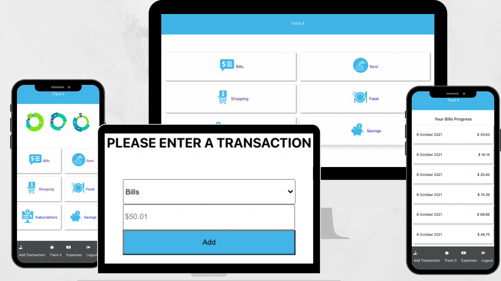

# Track It Finance App
## Project Description
Tracker app is an application designed to track your spending and savings using back-end API, which was also custom built for this app ([API Repo](https://github.com/Stephanie041996/Track-it-backend)). It fetches data such as the different categorys of your finances eg Savings, Rent, Bills etc. It also allows user to post new transaction datato help keep track of how much you send or save in each category. and View all these expenses in thier category

### Features
- Login with username
- Responsive design that works for Mobile and Desktop
- Track finance data such as savings, bills,  rent, shopping, food and subscriptions
- Post new transaction data
## BUILT WITH
- JavaScript
- NPM
- Node.js
- CSS
- ES6
- React
- React-Create-App
- Redux
- CSS

## Live Demo
# [view site](https://track-it-finance.herokuapp.com/reg)

## Getting Started
# Prerequisities

To run this project locally, you must have node and npm installed on your machine.

# Setup
To set up this project on your local machine:

Navigate to the folder where you want the repository to be copied and run 

`git clone https://github.com/Stephanie041996/Track_it_Frontend.git`

Navigate to the directory :

`cd track-it-frontend`

To start the server: 

`npm start`

Go to http://localhost:3000/ in your browser to see the application running

# To test the code

 - Run npm test
 - Enter 'a' to see all tests
## Author
**Stephanie Sakuhuni**

- GitHub: [@stephanie041996](https://github.com/Stephanie041996)
- LinkedIn: [Stephanie Sakuhuni](www.linkedin.com/in/stephanie-michelle-sakuhuni) 

​
- 
## 🤝 Contributing

Contributions, issues, and feature requests are welcome!

Feel free to check the [issues page](../../issues/).

## Show your support

Give a ⭐️ if you like this project!

## Acknowledgments

- Hat tip to anyone whose code was used
- Inspiration
- etc

## 📝 License

This project is [MIT](./MIT.md) licensed.
